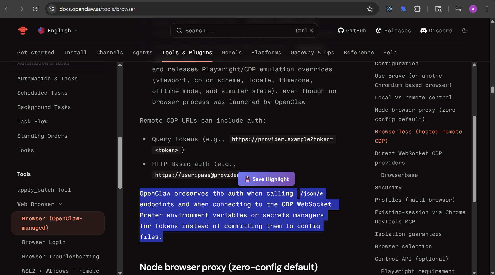
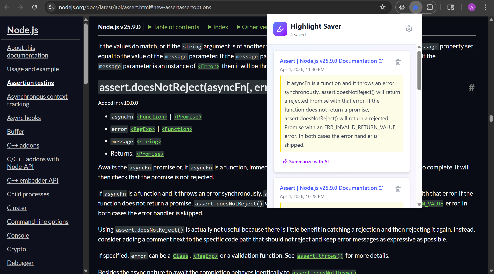
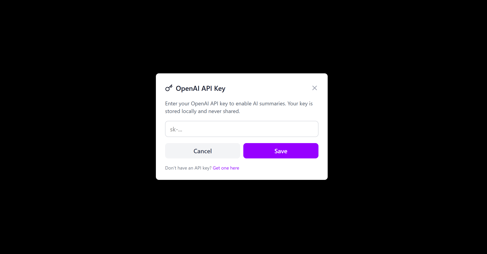
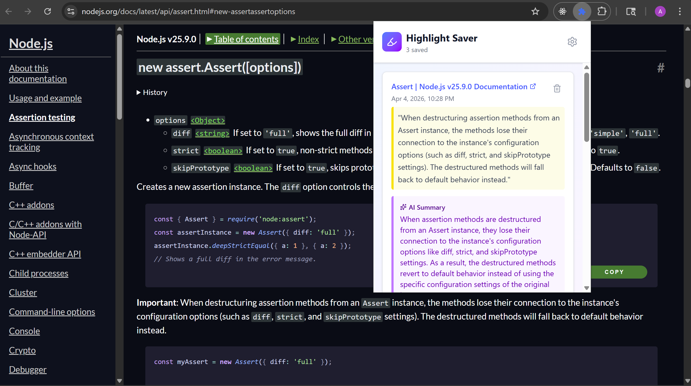

# Website Highlight Saver - Chrome Extension Setup

## Building the Extension

1. Install dependencies:

   ```bash
   npm install
   ```

2. Build the extension:
   ```bash
   npm run build
   ```

## Loading the Extension in Chrome

1. Open Chrome and navigate to `chrome://extensions/`

2. Enable "Developer mode" by toggling the switch in the top right corner

3. Click "Load unpacked"

4. Select the `dist` folder from this project

5. The extension should now appear in your extensions list

## Using the Extension

### Saving Highlights

1. Visit any webpage
2. Select text you want to highlight
3. A popup will appear asking "Save Highlight?"
4. Click the popup to save the highlight

### Viewing Highlights

1. Click the extension icon in your Chrome toolbar
2. A popup will open showing all your saved highlights
3. Each highlight shows:
   - The highlighted text
   - The page title and URL
   - The date and time it was saved

### Deleting Highlights

- Click the trash icon on any highlight card to remove it

### AI Summaries

1. Click the settings icon in the extension popup
2. Enter your OpenAI API key
3. Click "Summarize with AI" on any highlight to get a quick summary

## Notes

- All highlights are stored locally in your browser
- Your OpenAI API key (if provided) is stored in extension storage (session storage by default)
- The extension works on all websites
- Highlights are organized with the most recent first

## Privacy & Data Handling

- The extension reads only user-selected text when you highlight content and click save.
- Saved highlights are stored in Chrome extension storage on your device.
- If you choose to use AI summaries, selected highlight text is sent to OpenAI only when you click "Summarize with AI".
- Your API key is used only for direct OpenAI requests and is not sent to any other service.
- The extension has no remote database and no tracking/analytics.

## Chrome Permissions Used

- `storage`: save highlights and optional API key.
- Content script on `http://*/*` and `https://*/*`: detect user text selection and show save popup.
- `https://api.openai.com/*` host permission: call OpenAI API for optional summaries.

## Screen Record Video

[](https://jumpshare.com/s/8dXvE8POrPmgwOeCww3I)

> User can highlight text on any website and highlight popper button would appear which then by clicking it will get saved.

## Screen shots



> Saved highlights get saved to the chrome extension into a list from where user can visit the website from where the text was saved, deleted highlighted text.



> For the first time when user clicks on Summarize with AI button user will get redirected to the OpenAI API key insertion & if correct will get saved to the extention storage.



Finally when user when clicks on Summarize with AI again, this time API hits and in response summrized text is updated in the UI.
